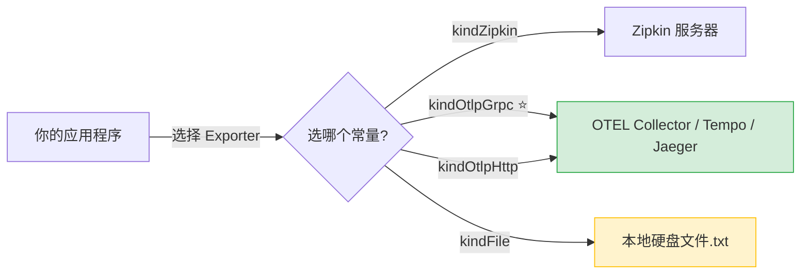

完全没关系！OpenTelemetry 的概念确实比较多。我们抛开所有技术术语，用一个**“快递寄包裹”**的生活比喻来解释这四个常量到底在干什么。

### 📦 核心比喻：你的程序 = 发件人

想象你的应用程序（比如一个网站后端）是一个 **电商仓库** 。

* **包裹（数据）：** 仓库里产生的订单记录、错误日志、性能指标。
* **快递员（Exporter）：** 负责把包裹运走的物流公司。
* **目的地（Backend）：** 最终存放和分析这些包裹的总仓/数据中心。

你代码里的这 4 个常量， **就是在选择“用哪家快递公司”以及“送到哪个总仓”** 。

---

### 🔍 逐个拆解：谁发送？发到哪？怎么发？

#### 1. `kindZipkin = "zipkin"`

* **谁发送：** 你的应用程序（通过 Zipkin 专属快递员）。
* **发送到哪里：** 只能发送到  **Zipkin 服务器** 。
* **通俗理解：** 就像你选择了“京东物流”，但京东只送京东自营仓。这是一种**老牌的、专用的**追踪系统，如果你的公司以前就在用 Zipkin，选这个就能无缝对接。

#### 2. `kindOtlpGrpc = "otlpgrpc"` （⭐ 最推荐）

* **谁发送：** 你的应用程序（通过 OpenTelemetry 官方标准快递员）。
* **发送到哪里：** 任何支持 OTLP 标准的现代后端（如 Grafana Tempo、Jaeger、阿里云 ARMS、自建 OTEL Collector 等）。
* **通俗理解：** 这是  **“顺丰特快专列”** 。它是 OpenTelemetry 亲生的标准协议，速度最快、效率最高、能送所有类型的包裹（链路、指标、日志）。**90% 的新项目都应该选这个。**

#### 3. `kindOtlpHttp = "otlphttp"`

* **谁发送：** 你的应用程序（同样通过 OpenTelemetry 官方标准快递员）。
* **发送到哪里：** 和上面一样，任何支持 OTLP 的后端。
* **通俗理解：** 这是  **“顺丰普通汽运”** 。送的目的地和特快一样，但走的是 HTTP 公路而不是 gRPC 专列。 **当你的网络环境不允许走专列（比如被防火墙拦截），或者你在浏览器前端发数据时** ，就用这个替代方案。

#### 4. `kindFile = "file"`

* **谁发送：** 你的应用程序（自己拿个笔记本记下来）。
* **发送到哪里：**  **不发给任何人** ，直接写在你服务器的本地硬盘文件里。
* **通俗理解：** 相当于  **“草稿纸”** 。包裹根本不出门，就堆在仓库角落里。这只用于开发人员在自己电脑上调试时说：“我先看看数据长什么样对不对”， **绝对不能用于生产环境** 。

---

### 🗺️ 一张图总结数据流向



### 💡 给你的行动建议

如果你刚开始接触 OpenTelemetry，不知道选哪个：

1. **开发调试阶段：** 先用 `kindFile`，确认数据能正常产生。
2. **正式上线：** 无脑选 `kindOtlpGrpc`，把数据发到你们团队选定的可观测性平台（Grafana/Jaeger/云厂商服务等）。
3. **遇到网络问题：** 换成 `kindOtlpHttp` 试试。
4. **公司有历史包袱：** 如果运维告诉你“我们用 Zipkin”，那就选 `kindZipkin`。

这样解释是否清晰了一些？如果你告诉我你具体想把数据送到哪个平台（比如 Grafana、Datadog、还是自己搭的服务），我可以帮你直接确定该选哪一个。


✅ **完全正确！** `kindOtlpGrpc` + Grafana 是目前最主流、最标准的可观测性方案。

但为了让你**不走弯路**，有一个关键细节必须补充：

### ⚠️ 重要提醒：Grafana 本身不直接收数据

Grafana 只是一个 **“展示面板”**（相当于电视屏幕），它自己不能直接接收 OTLP 数据。你需要一个 **“中间件/数据管道”** 来接收、处理并存储数据。

#### 正确的完整链路是这样的：

```
你的应用 (kindOtlpGrpc)
       ↓ gRPC:4317
OTEL Collector / Grafana Agent  ← 【必须有这一层】
       ↓
┌──────────────────────────────┐
│  Grafana 后端存储            │
│  • Tempo   → 存 Traces      │
│  • Mimir/Prometheus → Metrics│
│  • Loki    → 存 Logs        │
└──────────────────────────────┘
       ↓
Grafana Dashboard (统一查看)
```

### 🎯 你实际需要做的选择

| 你的情况                   | 推荐方案                                               | 说明                                      |
| :------------------------- | :----------------------------------------------------- | :---------------------------------------- |
| **用 Grafana Cloud** | `kindOtlpGrpc` → 直连 Grafana Cloud Endpoint        | 云端帮你托管了 Collector + 存储，开箱即用 |
| **自建 Grafana**     | `kindOtlpGrpc` → OTEL Collector → Tempo/Mimir/Loki | 需要自己部署存储后端                      |
| **只想最快看到效果** | `kindOtlpGrpc` → Grafana Alloy (原Agent)            | 轻量级，自动转发到本地或云端              |

### 💡 一句话总结

> **`kindOtlpGrpc` 负责“寄快递”，Grafana 负责“看报表”，中间还需要一个“收发室”（Collector/Alloy + 存储后端）来衔接。** 三者配齐，Trace / Metrics / Logs 就能在同一个 Grafana 界面里关联查看了。

如果你告诉我你是用 **Grafana Cloud** 还是 **自建**，我可以给你一份精确的配置清单，避免踩坑 😊


`semconv` 是  **Semantic Conventions** （语义约定）的缩写。

在 OpenTelemetry 中，它是一套  **“标准化的命名规范和数据字典”** 。

### 🤔 为什么需要它？

想象一下，如果没有统一标准：

* 你的 Java 服务把 HTTP 状态码字段叫 `http.status`
* 同事的 Go 服务把它叫 `statusCode`
* 另一个 Python 服务叫 `response_code`

当这些数据汇总到 Grafana 时，你根本 **无法写出一条通用的查询语句** ，也无法跨服务做关联分析。

`semconv` 就是为了解决这个问题而生的  **“普通话”** 。它规定了所有遥测数据中通用概念的 **标准字段名、取值范围和含义** 。

### 📋 它具体规定了什么？

| 领域   | semconv 标准字段名            | 错误/不规范的写法                  | 说明                     |
| :----- | :---------------------------- | :--------------------------------- | :----------------------- |
| HTTP   | `http.request.method`       | `method`,`verb`,`httpMethod` | 请求方法 (GET/POST)      |
| HTTP   | `http.response.status_code` | `status`,`code`,`statusCode` | 响应状态码               |
| 数据库 | `db.system`                 | `database_type`,`dbType`       | 数据库类型 (mysql/redis) |
| 网络   | `network.peer.address`      | `client_ip`,`remoteAddr`       | 对端 IP 地址             |
| 异常   | `exception.type`            | `error_class`,`errType`        | 异常类名                 |
| RPC    | `rpc.method`                | `func_name`,`apiMethod`        | RPC 方法名               |

### 💡 对你来说意味着什么？

1. **开箱即用的仪表盘：** Grafana / Datadog 等后端内置了对 semconv 的识别。只要你用了 semconv，导入预置 Dashboard 就能直接看到图表，无需手动映射字段。
2. **跨语言/跨框架统一：** 无论用 Go、Java、Python 还是 Node.js，只要遵循 semconv，产生的数据格式完全一致。
3. **代码中的体现：** 各语言的 OTel SDK 都提供了 semconv 常量包，例如 Go 中的 `go.opentelemetry.io/otel/semconv/v1.26.0`，直接用常量而不是手写字符串，避免拼写错误。

### ⚠️ 注意事项

> semconv 仍在**持续演进**中（目前稳定版 v1.x 系列），不同版本的字段名可能有细微变化。建议锁定一个具体版本使用，并在升级时关注 changelog。

**一句话总结：** `semconv` = OpenTelemetry 世界的  **“数据字段国家标准”** ，让你的遥测数据说“普通话”，在任何平台上都能被正确理解和展示。
